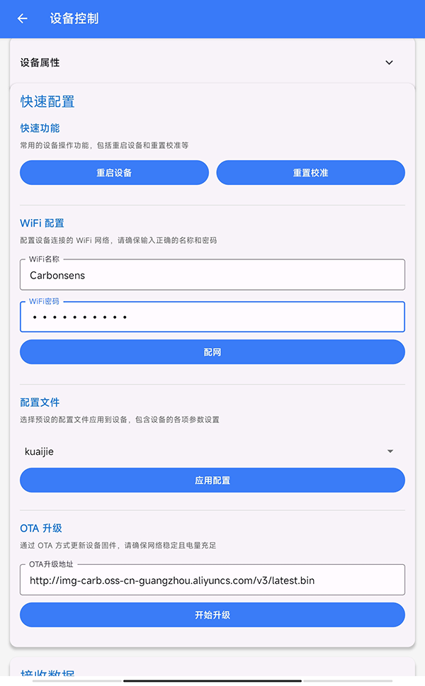

# TsHelp 使用指南

## 下载安装

扫描以下二维码下载安装TsHelp APP:

    

## 建议

- 配网可以直接配置设备，无需使用配置文件。
- 如果需要配置设备，先使用配置文件功能创建配置文件，再连接设备进行配置。

## 1. 设备配置

设备配置功能用于连接和配置单个设备。

### 基本操作流程:

1. 在首页点击"设备配置"进入

    

2. 设置扫描参数:
   - 设备名称前缀(默认为"TSKJ") 
   - 信号强度阈值(-100 到 0 dBm)
   - 扫描超时时间(建议5-30秒)

    

3. 点击"开始扫描"搜索设备
4. 在设备列表中选择要配置的设备，进入设备配置面板中，点击"连接设备"
   
   **注意事项：**
   - 配置完设备后，记得断开连接；
   - 如果下一次搜索不到设备，请重启设备或者APP。

    

1. 连接设备后可以进行:
   - WiFi配网
   - 加载配置文件
   - OTA固件升级
   - 发送自定义命令

    

## 2. 批量配置

批量配置功能可以同时对多个设备进行配置。

### 基本操作流程:

1. 在首页点击"批量配置"进入

    

2. 扫描并选择要配置的设备

    

3. 配置任务:
   - 选择任务类型(OTA升级/WiFi配网/应用配置)多选项
   - 根据选择的任务类型填写相应参数

4. 点击"开始任务"执行配置
   - 可以通过暂停/继续/停止来控制任务
   - 任务完成后可导出配置结果（暂时不可用）

    

## 3. 配置文件管理

配置文件功能用于创建和管理设备配置模板。

### 基本操作流程:

1. 在首页点击"配置文件"进入

    

2. 可以进行以下操作:
   - 点击"新建配置"创建配置文件
   

       
   

   - 选择已有配置文件进行编辑
   

       
   

   - 重命名或删除配置文件
3. 编辑配置文件时:
   - 修改配置名称
   - 编辑配置参数
   - 点击保存图标保存修改
