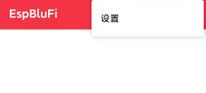

# EspBlufi APP 安装和使用教程

## 1. 安装 EspBlufi
- **安卓用户**：
  - 下载链接：[EspBlufi APK](https://github.com/EspressifApp/EspBlufiForAndroid/releases/download/v1.6.3/EspBluFi-1.6.3-29.apk)

- **iOS 用户**：
  - 可以在应用商店下载：[EspBlufi APP](https://apps.apple.com/us/app/espblufi/id1450614082)

## 2. 设置设备过滤器

- 打开 EspBlufi APP 

    

- 点击右上角的设置图标

    

- 按照以下步骤，将设备过滤器规则设置为：`TSKJ`。

    

    

    

## 3. 连接设备
- 在主页下滑，搜索设备，点击设备名称

    

- 根据提示，将设备连接到网络。

    

    

    

    注意：只能连2.4G网络

## 4. 完成网络连接
- 一旦设备成功连接到网络，您将看到连接成功的提示
- 

    

